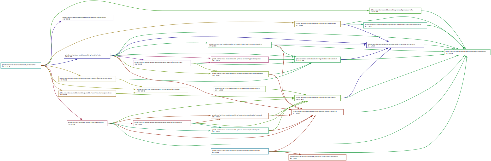

# Modular Monolith in Go

A reference implementation of a **modular monolith** in Go, applying Clean Architecture, A Philosophy of Software Design, and Domain-Driven Design to manage complexity at scale.

## Why Modular Monolith?

Microservices solve organizational problems, not technical ones. For most teams, a modular monolith offers the benefits of bounded contexts without the operational cost of distributed systems:

- **Module isolation** — Enforce boundaries at compile time via Go's module system, not just by convention
- **Independent developability** — Teams own modules; changes don't ripple across the codebase
- **Deferred distribution** — Extract to microservices when organizational scaling demands it, not before
- **Strong consistency** — ACID transactions within the monolith boundary; no saga complexity

The goal is to manage **complexity** (Ousterhout's central insight) by decomposing the system into modules with deep interfaces that hide implementation details.

## Architecture Overview

```
┌─────────────────────────────────────────────────────────────────────────────┐
│                              cmd/server                                     │
│                         (Composition Root)                                  │
└─────────────────────────────────────────────────────────────────────────────┘
                                    │ wires dependencies
         ┌──────────────────────────┼──────────────────────────┐
         ▼                          ▼                          ▼
┌─────────────────┐      ┌─────────────────┐      ┌─────────────────┐
│     users       │      │     orders      │      │  notifications  │
│ Bounded Context │      │ Bounded Context │      │ Bounded Context │
├─────────────────┤      ├─────────────────┤      ├─────────────────┤
│    Module API   │      │    Module API   │      │    Module API   │
│  (deep module)  │      │  (deep module)  │      │  (deep module)  │
├─────────────────┤      ├─────────────────┤      ├─────────────────┤
│     domain      │      │     domain      │      │   application   │
│   application   │      │   application   │      │  (event-driven) │
│  infrastructure │      │  infrastructure │      └─────────────────┘
└────────┬────────┘      └────────┬────────┘               │
         │                        │                        │
         │ UserDeleted ──────────►├────────────────────────┘
         │                        │ OrderSubmitted ────────►
         │                        │
         ▼                        ▼
┌─────────────────────────────────────────────────────────────────────────────┐
│                          internal/platform                                  │
│         (Event Bus, HTTP Server, Database Client — Infrastructure)          │
└─────────────────────────────────────────────────────────────────────────────┘
```

### Context Map (DDD)

| Upstream | Downstream    | Relationship      | Integration            |
| -------- | ------------- | ----------------- | ---------------------- |
| users    | orders        | Customer-Supplier | `UserDeleted` event    |
| orders   | notifications | Customer-Supplier | `OrderSubmitted` event |
| shared   | all modules   | Shared Kernel     | Event interfaces only  |

Modules communicate exclusively through **domain events** — no direct imports of another module's internals. This creates an **Anti-Corruption Layer** by design.

### Module Dependency Graph

The following graph visualizes the internal package dependencies. Note how modules only depend on `shared` (the Shared Kernel) and never import each other's internals directly.



**Key observations:**

- `cmd/server` is the composition root that wires all modules together
- Each module (`users`, `orders`, `notifications`) depends only on `shared/events` for cross-module communication
- `internal/platform` provides infrastructure without leaking into domain code
- No circular dependencies exist between modules

To regenerate: `make deps-svg`

## Design Principles

### Deep Modules (A Philosophy of Software Design)

Each module exposes a minimal interface while hiding substantial complexity:

```go
// The entire public API of the users module
type Module interface {
    RegisterRoutes(mux *http.ServeMux)
}
```

Behind this single method lies domain logic, validation, persistence, event publishing, and HTTP handling. Consumers don't see any of it — they just register routes. This is Ousterhout's "deep module": **simple interface, complex implementation**.

The alternative — exposing `CreateUser()`, `GetUser()`, `UpdateUser()`, etc. — would be a "shallow module" that pushes complexity onto callers and creates tight coupling.

### The Dependency Rule (Clean Architecture)

Dependencies point inward to protect business rules from infrastructure volatility:

```
infrastructure → application → domain
       ↓              ↓           ↓
   (volatile)    (use cases)  (stable)
```

**Why?** Frameworks change. Databases change. HTTP conventions change. Business rules change less frequently. By pointing dependencies inward, infrastructure changes don't propagate to domain code.

- **Domain**: Pure business logic. No imports except standard library.
- **Application**: Orchestrates use cases. Depends only on domain.
- **Infrastructure**: Adapters (HTTP, persistence). Implements domain interfaces.

Repository interfaces are defined in `domain/` (the port), implemented in `infrastructure/` (the adapter). This is Dependency Inversion — high-level modules don't depend on low-level modules; both depend on abstractions.

### Aggregates as Consistency Boundaries (DDD)

An Aggregate defines a **transaction boundary**. All invariants within an Aggregate are guaranteed consistent after each operation:

```go
type Order struct {
    id     OrderID         // Aggregate root identity
    items  []OrderItem     // Owned entities
    status Status          // Invariant: status transitions are validated
    total  Money           // Invariant: always equals sum of items
}

func (o *Order) AddItem(item OrderItem) error {
    if o.status != StatusDraft {
        return ErrOrderNotDraft  // Enforce invariant
    }
    o.items = append(o.items, item)
    o.recalculateTotal()         // Maintain invariant
    return nil
}
```

Cross-Aggregate consistency is **eventual**, achieved through domain events. This is why `UserDeleted` triggers order cancellation asynchronously, not in the same transaction.

### CQRS: Separate Read and Write Models

Commands and Queries are separated not just for code organization, but for **independent optimization**:

```
commands/                      queries/
├── create_order.go           ├── get_order.go
├── add_item.go               └── list_user_orders.go
└── submit_order.go

Commands:                      Queries:
- Validate business rules      - Optimized for reads
- Mutate aggregate state       - Can use denormalized views
- Publish domain events        - No side effects
- Return minimal data (ID)     - Return DTOs
```

Today, both use the same database. Tomorrow, queries could read from a materialized view or read replica without changing command logic.

## Project Structure

```
.
├── cmd/server/               # Composition root — wires all dependencies
├── internal/platform/        # Infrastructure shared across modules
│   ├── eventbus/             # In-memory event bus (swap for Pub/Sub)
│   ├── httpserver/           # HTTP server, middleware
│   └── spanner/              # Database client
├── modules/
│   ├── shared/               # Shared Kernel — event interfaces only
│   ├── users/                # User management bounded context
│   ├── orders/               # Order management bounded context
│   └── notifications/        # Notification bounded context
└── go.work                   # Go workspace (enforces module boundaries)
```

### Module Structure

```
modules/{name}/
├── module.go                  # Public API (Module interface + New factory)
├── domain/
│   ├── {aggregate}.go         # Aggregate root — business logic lives here
│   ├── {aggregate}_id.go      # Typed ID (prevents primitive obsession)
│   ├── value_objects.go       # Immutable, validated at construction
│   ├── events.go              # Domain events this module publishes
│   ├── repository.go          # Port — interface for persistence
│   └── errors.go              # Domain errors (part of ubiquitous language)
├── application/
│   ├── commands/              # Write use cases
│   ├── queries/               # Read use cases
│   └── eventhandlers/         # React to other modules' events
└── infrastructure/
    ├── http/                  # Adapter — HTTP handlers
    └── persistence/           # Adapter — repository implementation
```

## Patterns in Practice

### Value Objects: Validate at Construction

Invalid data never enters the domain. Validation happens once, at the boundary:

```go
type Email struct {
    value string  // Private — cannot be modified after creation
}

func NewEmail(raw string) (Email, error) {
    normalized := strings.TrimSpace(strings.ToLower(raw))
    if !emailRegex.MatchString(normalized) {
        return Email{}, ErrEmailInvalid
    }
    return Email{value: normalized}, nil
}

// No setter. Email is immutable.
func (e Email) String() string { return e.value }
```

Once you have an `Email`, it's guaranteed valid. No defensive checks needed downstream.

### Aggregate Reconstitution: Separate Creation from Hydration

Two ways to get an Aggregate:

```go
// 1. Business creation — validates invariants
func NewUser(email Email, name Name) *User {
    return &User{
        id:        NewUserID(),  // Generate new ID
        email:     email,
        name:      name,
        status:    StatusActive, // Default state
        createdAt: time.Now(),
    }
}

// 2. Persistence hydration — trusts stored data
func Reconstitute(id UserID, email Email, ...) *User {
    return &User{id: id, email: email, ...}  // No validation
}
```

`Reconstitute` exists because data from the database was already validated when saved. Re-validating is wasteful and can break if validation rules evolve.

### Domain Events: Eventual Consistency Across Modules

Events are facts about what happened, not requests for action:

```go
// Defined in users/domain/events.go
type UserDeleted struct {
    events.BaseEvent
    UserID string `json:"user_id"`
}

// Published after successful deletion
func (h *DeleteUserHandler) Handle(ctx context.Context, cmd DeleteUserCommand) error {
    user, _ := h.repo.FindByID(ctx, cmd.UserID)
    user.Delete()
    h.repo.Save(ctx, user)
    h.publisher.Publish(ctx, NewUserDeletedEvent(user.ID()))  // Fire and forget
    return nil
}

// Handled by orders module — cancels pending orders for deleted user
func (h *UserDeletedHandler) Handle(ctx context.Context, event events.Event) error {
    e := event.(*userdomain.UserDeleted)
    return h.cancelOrders.Handle(ctx, CancelOrdersForUser{UserID: e.UserID})
}
```

The users module doesn't know (or care) that orders exist. Loose coupling.

## Getting Started

### Prerequisites

- Go 1.22+
- Docker (for Spanner emulator)

### Running Locally

```bash
# Start Spanner emulator
docker run -p 9010:9010 -p 9020:9020 gcr.io/cloud-spanner-emulator/emulator

# Configure environment
export SPANNER_EMULATOR_HOST=localhost:9010
export SPANNER_PROJECT_ID=local-project
export SPANNER_INSTANCE_ID=local-instance
export SPANNER_DATABASE_ID=app-db

# Run
make run
```

### Commands

```bash
make build      # Build binary
make test       # Run all tests
make lint       # Static analysis
make tidy       # go mod tidy all modules
make deps-graph # Check cross-module dependencies (text)
make deps-svg   # Generate dependency graph (docs/deps.svg)
```

## Production Considerations

| Concern        | This Implementation      | Production                     |
| -------------- | ------------------------ | ------------------------------ |
| Event delivery | In-memory, synchronous   | Outbox pattern + Cloud Pub/Sub |
| Database       | Spanner emulator         | Cloud Spanner                  |
| Observability  | Structured logging       | Cloud Trace + Cloud Monitoring |
| Event ordering | Single process guarantee | Partition by aggregate ID      |

The architecture supports this evolution. Swap adapters in `internal/platform/`; domain and application code remain untouched. That's the promise of Clean Architecture.

## References

- Ousterhout, J. — [A Philosophy of Software Design](https://web.stanford.edu/~ouster/cgi-bin/book.php)
- Martin, R. — [Clean Architecture](https://blog.cleancoder.com/uncle-bob/2012/08/13/the-clean-architecture.html)
- Evans, E. — [Domain-Driven Design](https://www.domainlanguage.com/ddd/)
- Grzybek, K. — [Modular Monolith with DDD](https://github.com/kgrzybek/modular-monolith-with-ddd)
- Brandolini, A. — [Introducing EventStorming](https://eventstorming.com/)

## License

MIT
