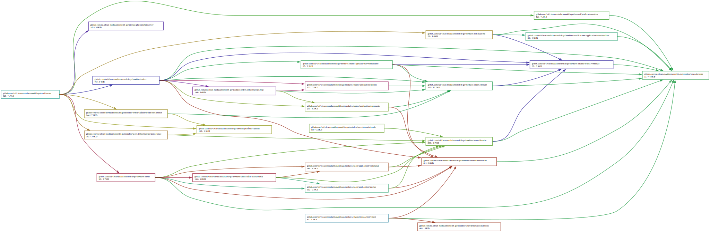

# Modular Monolith in Go

A reference implementation of a **modular monolith** applying Clean Architecture, Domain-Driven Design, and A Philosophy of Software Design.

## Design Philosophy

**Complexity is the enemy.** This project demonstrates how to build a system that remains understandable and maintainable as it grows — not by adding more process, but by making better design decisions.

### Why Modular Monolith?

Microservices solve organizational problems, not technical ones. For most systems, a modular monolith offers bounded contexts without the operational cost of distributed systems:

- **Compile-time boundary enforcement** — Go's module system prevents accidental coupling
- **ACID transactions** — No saga complexity; consistency within the monolith boundary
- **Deferred distribution** — Extract to microservices when organizational scaling demands it, not before

## Architecture

```
┌─────────────────────────────────────────────────────────────────────────────┐
│                              cmd/server                                     │
│                         (Composition Root)                                  │
└─────────────────────────────────────────────────────────────────────────────┘
                                    │ wires dependencies
         ┌──────────────────────────┼──────────────────────────┐
         ▼                          ▼                          ▼
┌─────────────────┐      ┌─────────────────┐      ┌─────────────────┐
│     users       │      │     orders      │      │  notifications  │
│ Bounded Context │      │ Bounded Context │      │ Bounded Context │
├─────────────────┤      ├─────────────────┤      ├─────────────────┤
│    Module API   │      │    Module API   │      │    Module API   │
│  (deep module)  │──────│  (deep module)  │──────│  (deep module)  │
└────────┬────────┘      └────────┬────────┘      └─────────────────┘
         │                        │                        ▲
         │ UserDeleted ──────────►│                        │
         │                        │ OrderSubmitted ────────┘
         ▼                        ▼
┌─────────────────────────────────────────────────────────────────────────────┐
│                          internal/platform                                  │
│            (Event Bus, Transaction Scope, HTTP Server, Spanner)             │
└─────────────────────────────────────────────────────────────────────────────┘
```

## Key Design Decisions

### 1. Deep Modules over Shallow Modules

Each module exposes a minimal interface while hiding substantial complexity:

```go
// The entire public API of the users module
type Module interface {
    RegisterRoutes(mux *http.ServeMux)
}
```

Behind this single method lies domain logic, validation, persistence, event publishing, and HTTP handling. Consumers don't see any of it. This is Ousterhout's "deep module": **simple interface, complex implementation**.

The alternative — exposing `CreateUser()`, `GetUser()`, `UpdateUser()` — would be a "shallow module" that pushes complexity onto callers and creates tight coupling.

### 2. Transaction Scope — Deep Module by Design

Transaction management is this project's most deliberate application of Ousterhout's Deep Module principle. Two interfaces hide all the complexity:

```go
// modules/shared/transaction/scope.go — Base port
type Scope interface {
    Execute(ctx context.Context, fn func(ctx context.Context) error) error
}

// modules/shared/transaction/event_scope.go — For command handlers
type ScopeWithDomainEvent interface {
    ExecuteWithPublish(ctx context.Context, fn func(ctx context.Context) error) error
}
```

Behind these simple interfaces, the implementation absorbs substantial complexity that callers never see:

```
               transaction.ScopeWithDomainEvent
            ┌──────────────────────────────────┐
  Simple    │  ExecuteWithPublish(ctx, fn)     │
  Interface └──────────────┬───────────────────┘
                           │
  ─ ─ ─ ─ ─ ─ ─ ─ ─ ─ ─ ─┼─ ─ ─ ─ ─ ─ ─ ─ ─ ─ ─ ─ ─ ─ ─
                           │
  Deep      ┌──────────────▼──────────────────────────────┐
  Impl      │  Initializes fresh event collector in ctx   │
            │  Delegates to Scope.Execute (begin/commit)  │
            │  Spanner retry on Aborted errors            │
            │  Collects events from ctx after fn succeeds │
            │  Publishes events via EventBus              │
            └─────────────────────────────────────────────┘
```

**Why this matters:** Command handlers are completely unaware of Spanner, retries, or event publishing. They just execute business logic:

```go
// Command handler — knows nothing about Spanner, retries, or event publishing
func (h *DeleteUserHandler) Handle(ctx context.Context, cmd DeleteUserCommand) error {
    userID, _ := domain.ParseUserID(cmd.UserID)

    return h.txScope.ExecuteWithPublish(ctx, func(ctx context.Context) error {
        user, _ := h.repo.FindByID(ctx, userID)
        user.Delete(ctx)             // ← Adds event to ctx collector
        return h.repo.Save(ctx, user)
    })
    // Events published automatically after successful fn; transaction commits
}
```

**The layered abstraction (Clean Architecture dependency rule):**

```
  modules/shared/transaction/         ← Port (interfaces)
  Command handlers depend on this       No infrastructure knowledge
          │
          │ implements
          ▼
  internal/platform/spanner/          ← Adapter (implementation)
  ReadWriteTransactionScope             Spanner-specific lifecycle
  ReadOnlyTransactionScope              Retry logic, context embedding
```

The transaction is embedded in `ctx` — repositories extract it automatically. This means repositories work both inside and outside transactions with no dual codepath.

### 3. Transactional Domain Events

Events and state changes must be atomic. `ScopeWithDomainEvent` ensures they always commit together:

```go
// In module.go — wire ScopeWithDomainEvent once
txScope := transaction.NewScopeWithDomainEvent(cfg.TransactionScope, cfg.Publisher)

// In command handler — just run business logic
return h.txScope.ExecuteWithPublish(ctx, func(ctx context.Context) error {
    user := domain.NewUser(ctx, email, name)  // Adds UserCreatedEvent to ctx
    return h.repo.Save(ctx, user)
})
// ScopeWithDomainEvent publishes events after fn succeeds, before commit
// If any handler fails → entire transaction rolls back
// If commit fails → no events were "published" externally
```

Event handlers receive the same `ctx` containing the active transaction. They can read and write within that transaction, ensuring cross-module consistency without distributed coordination.

### 4. Aggregates Emit Their Own Events

The aggregate knows which events should occur when business rules execute. Events are added to the context-bound collector:

```go
func (u *User) Delete(ctx context.Context) error {
    u.status = StatusDeleted
    u.updatedAt = time.Now().UTC()
    events.Add(ctx, newUserDeletedEvent(u.id))  // Self-contained
    return nil
}
```

This keeps business logic cohesive — the aggregate, not the application service, decides what events to emit. `ScopeWithDomainEvent` drains and publishes whatever was added to `ctx` after the transaction body succeeds.

### 5. Event Contracts as Public API

Modules don't import each other's domain packages. Instead, event contracts are published in a shared kernel:

```go
// shared/events/contracts/users.go — This IS the public API
const UserDeletedEventType events.EventType = "users.UserDeleted"

type UserDeletedEvent struct {
    events.BaseEvent
    UserID string `json:"user_id"`
}
```

The orders module subscribes to `UserDeletedEvent` without knowing anything about the users module's internals. This is an **Anti-Corruption Layer by design**.

### 6. Value Objects Validate at Construction

Invalid data never enters the domain:

```go
type Email struct {
    value string  // Private — immutable after creation
}

func NewEmail(raw string) (Email, error) {
    if !emailRegex.MatchString(raw) {
        return Email{}, ErrEmailInvalid
    }
    return Email{value: normalized}, nil
}
```

Once you have an `Email`, it's guaranteed valid. No defensive checks needed downstream.

### 7. Reconstitution Separates Creation from Hydration

Two ways to get an aggregate:

```go
// Business creation — validates invariants, generates ID, raises event
func NewUser(email Email, name Name) *User

// Persistence hydration — trusts stored data, no validation
func Reconstitute(id UserID, email Email, ...) *User
```

`Reconstitute` exists because data from the database was already validated when saved. Re-validating is wasteful and can break if validation rules evolve.

## Module Structure

```
modules/{name}/
├── module.go              # Public API (Module interface + New factory)
├── domain/
│   ├── {aggregate}.go     # Aggregate root with business logic
│   ├── {value_objects}.go # Immutable, validated at construction
│   ├── events.go          # Domain events this module publishes
│   └── repository.go      # Port — interface for persistence
├── application/
│   ├── commands/          # Write use cases (change state)
│   ├── queries/           # Read use cases (return DTOs)
│   └── eventhandlers/     # React to other modules' events
└── infrastructure/
    ├── http/              # HTTP handlers
    └── persistence/       # Repository implementation
```

Dependencies point inward: `infrastructure → application → domain`. The domain layer has no external dependencies.

## Module Dependencies



Each module depends only on `shared/events` for cross-module communication. No circular dependencies.

## Getting Started

```bash
make build      # Build binary
make run        # Run server (requires Spanner emulator)
make test       # Run tests
make lint       # Static analysis
make deps-svg   # Generate dependency graph
```

## Trade-offs

| Decision | Benefit | Cost |
|----------|---------|------|
| Synchronous in-process events | Transaction consistency, simpler debugging | No parallelism, single point of failure |
| In-memory event bus | Zero infrastructure, predictable behavior | Not durable; for production, use outbox pattern |
| Module-per-bounded-context | Clear ownership, independent evolution | May need to split further as team grows |
| No ORM | Full control, explicit queries | More boilerplate |

## References

- Ousterhout, J. — [A Philosophy of Software Design](https://web.stanford.edu/~ouster/cgi-bin/book.php)
- Martin, R. — [Clean Architecture](https://blog.cleancoder.com/uncle-bob/2012/08/13/the-clean-architecture.html)
- Evans, E. — [Domain-Driven Design](https://www.domainlanguage.com/ddd/)

## License

MIT
