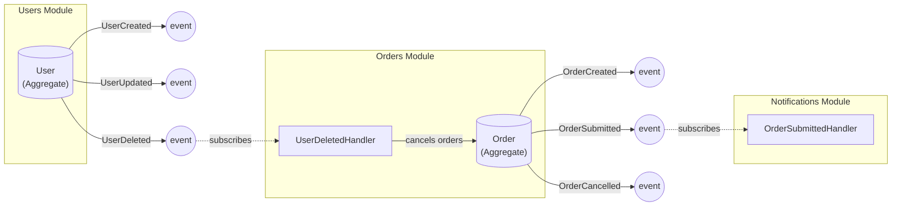

# Domain Events Overview

This document describes the domain events in this modular monolith and their subscribers.

## Event Flow Diagram



## Modules and Events

### Users Module

| Aggregate | Event Type          | Description                          |
| --------- | ------------------- | ------------------------------------ |
| User      | `users.UserCreated` | Published when a new user is created |
| User      | `users.UserUpdated` | Published when a user is updated     |
| User      | `users.UserDeleted` | Published when a user is deleted     |

### Orders Module

| Aggregate | Event Type              | Description                           |
| --------- | ----------------------- | ------------------------------------- |
| Order     | `orders.OrderCreated`   | Published when a new order is created |
| Order     | `orders.OrderSubmitted` | Published when an order is submitted  |
| Order     | `orders.OrderCancelled` | Published when an order is cancelled  |

**Subscriptions:**
| Event | Handler | Action |
|-------|---------|--------|
| `users.UserDeleted` | `UserDeletedHandler` | Cancels all draft/pending orders for the deleted user |

### Notifications Module

This module has no aggregates. It is purely event-driven.

**Subscriptions:**
| Event | Handler | Action |
|-------|---------|--------|
| `orders.OrderSubmitted` | `OrderSubmittedHandler` | Sends order confirmation email |

## Event Flow Summary

```
┌─────────────────┐     UserDeleted       ┌─────────────────┐
│                 │ ─────────────────────▶│                 │
│  Users Module   │                       │  Orders Module  │
│   (User Agg)    │                       │  (Order Agg)    │
└─────────────────┘                       └────────┬────────┘
                                                   │
                                          OrderSubmitted
                                                   │
                                                   ▼
                                         ┌─────────────────┐
                                         │  Notifications  │
                                         │     Module      │
                                         └─────────────────┘
```

## Transaction Boundaries

- **UserDeletedHandler** (in Orders): Runs within the same transaction as user deletion, ensuring atomic consistency
- **OrderSubmittedHandler** (in Notifications): Runs outside the transaction (async-ready for future Pub/Sub migration)
