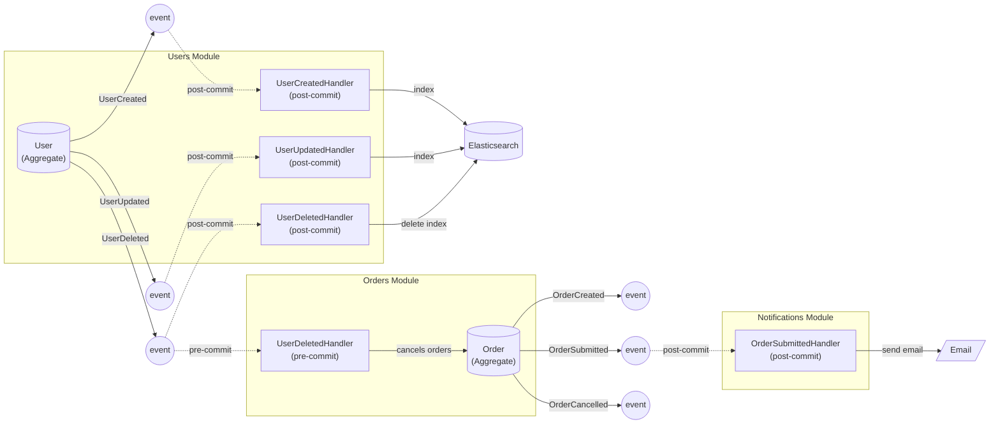

# Domain Events Overview

This document describes the domain events in this modular monolith and their subscribers.

## Event Flow Diagram


```mermaid
flowchart LR
    subgraph users["Users Module"]
        UserAggregate[("User<br/>(Aggregate)")]
        UserCreatedHandler["UserCreatedHandler<br/>(post-commit)"]
        UserUpdatedHandler["UserUpdatedHandler<br/>(post-commit)"]
        UserDeletedESHandler["UserDeletedHandler<br/>(post-commit)"]
    end

    subgraph orders["Orders Module"]
        OrderAggregate[("Order<br/>(Aggregate)")]
        UserDeletedHandler["UserDeletedHandler<br/>(pre-commit)"]
    end

    subgraph notifications["Notifications Module"]
        OrderSubmittedHandler["OrderSubmittedHandler<br/>(post-commit)"]
    end

    %% Users publishes events
    UserAggregate -->|"UserCreated"| UC((event))
    UserAggregate -->|"UserUpdated"| UU((event))
    UserAggregate -->|"UserDeleted"| UD((event))

    %% Orders publishes events
    OrderAggregate -->|"OrderCreated"| OC((event))
    OrderAggregate -->|"OrderSubmitted"| OS((event))
    OrderAggregate -->|"OrderCancelled"| OCa((event))

    %% Pre-commit subscriptions
    UD -.->|"pre-commit"| UserDeletedHandler

    %% Post-commit subscriptions
    UC -.->|"post-commit"| UserCreatedHandler
    UU -.->|"post-commit"| UserUpdatedHandler
    UD -.->|"post-commit"| UserDeletedESHandler
    OS -.->|"post-commit"| OrderSubmittedHandler

    %% Handler actions
    UserDeletedHandler -->|cancels orders| OrderAggregate
    UserCreatedHandler -->|index| ES[(Elasticsearch)]
    UserUpdatedHandler -->|index| ES
    UserDeletedESHandler -->|delete index| ES
    OrderSubmittedHandler -->|send email| Email[/Email/]
```

## Modules and Events

### Users Module

| Aggregate | Event Type          | Description                          |
| --------- | ------------------- | ------------------------------------ |
| User      | `users.UserCreated` | Published when a new user is created |
| User      | `users.UserUpdated` | Published when a user is updated     |
| User      | `users.UserDeleted` | Published when a user is deleted     |

**Subscriptions (post-commit):**
| Event | Handler | Phase | Action |
|-------|---------|-------|--------|
| `users.UserCreated` | `UserCreatedHandler` | post-commit | Indexes user in Elasticsearch |
| `users.UserUpdated` | `UserUpdatedHandler` | post-commit | Updates user in Elasticsearch |
| `users.UserDeleted` | `UserDeletedHandler` | post-commit | Removes user from Elasticsearch |

### Orders Module

| Aggregate | Event Type              | Description                           |
| --------- | ----------------------- | ------------------------------------- |
| Order     | `orders.OrderCreated`   | Published when a new order is created |
| Order     | `orders.OrderSubmitted` | Published when an order is submitted  |
| Order     | `orders.OrderCancelled` | Published when an order is cancelled  |

**Subscriptions (pre-commit):**
| Event | Handler | Phase | Action |
|-------|---------|-------|--------|
| `users.UserDeleted` | `UserDeletedHandler` | pre-commit | Cancels all draft/pending orders for the deleted user |

### Notifications Module

This module has no aggregates. It is purely event-driven.

**Subscriptions (post-commit):**
| Event | Handler | Phase | Action |
|-------|---------|-------|--------|
| `orders.OrderSubmitted` | `OrderSubmittedHandler` | post-commit | Sends order confirmation email |

## Event Flow Summary

```
┌─────────────────┐  UserDeleted (pre)    ┌─────────────────┐
│                 │ ─────────────────────▶│                 │
│  Users Module   │                       │  Orders Module  │
│   (User Agg)    │                       │  (Order Agg)    │
│                 │                       └────────┬────────┘
│  UserCreated ──▶│──(post)──▶ ES                  │
│  UserUpdated ──▶│──(post)──▶ ES         OrderSubmitted
│  UserDeleted ──▶│──(post)──▶ ES                  │ (post)
└─────────────────┘                                ▼
                                         ┌─────────────────┐
                                         │  Notifications  │
                                         │     Module      │
                                         └─────────────────┘
```

## Transaction Boundaries

- **UserDeletedHandler** (in Orders, pre-commit): Runs within the same transaction as user deletion, ensuring atomic consistency. Performs database operations only (cancels orders).
- **UserCreated/Updated/DeletedHandler** (in Users, post-commit): Runs after the transaction commits. Updates Elasticsearch indices for user search. Errors are logged but do not affect the caller.
- **OrderSubmittedHandler** (in Notifications, post-commit): Runs after the transaction commits. Sends order confirmation email. Errors are logged but do not affect the caller.
